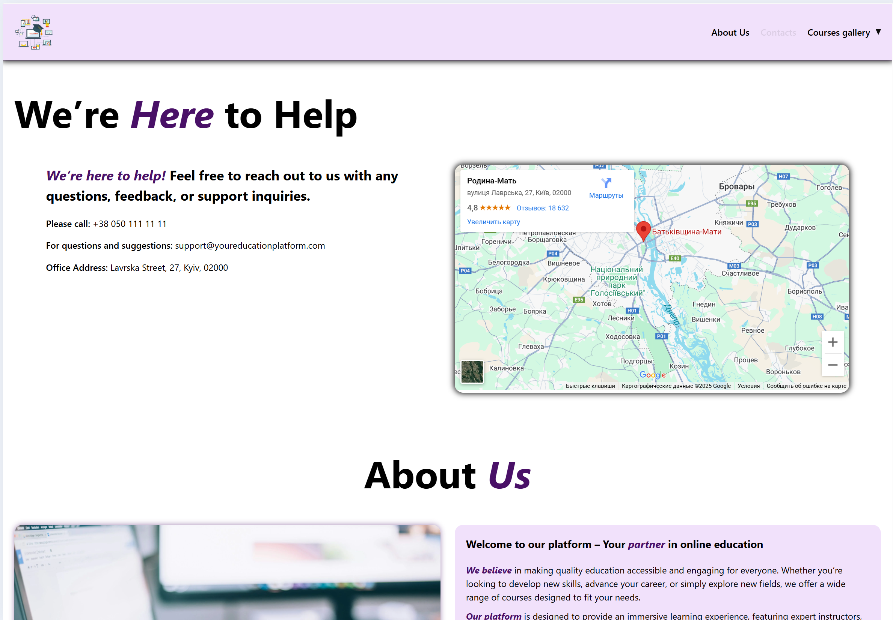

# Online Learning Platform

## Description

An educational platform for users to browse and access various courses. The platform includes dynamic features such as search, sorting, and filtering of courses, as well as a gallery showcasing available courses. It is built with modern web technologies for a responsive, user-friendly experience.

## Key features:

- **Home Page**: Image slider and responsive navigation menu with a submenu.
- **Gallery Page**: Course cards, pagination, sorting, filtering, and search functionality.
- **Contacts Page**: Map integration (Google Maps or OpenStreetMap).
- **General**: Fully responsive design using Flexbox/Grid and dynamic content loading.

## Technology stack

- Language: [**TypeScript**](https://www.typescriptlang.org/)
- Styling: [**SCSS**](https://sass-lang.com/)
- Linters: [**ESLint**](https://eslint.org/), [**Prettier**](https://prettier.io/)
- Builder: [**Vite**](https://vitejs.dev/)

## Visuals





# Installation

### Prerequisites

Make sure you have node.js installed on your machine before proceeding with the setup or installation process.
To check if Node.js is installed, you can use the following command:

```
node -v
```

Make sure nmp is installed by running

```
npm -v
```

## To get started with this project, follow the steps below:

1. Clone the repository:

```
git clone https://autocode.git.epam.com/belangelphone/capstone-project-template
```

2. Install dependencies:

```
npm install
```

3. Run the development server:

```
npm run dev
```

This will start the application at http://localhost:5173 (or another available port).

### SCSS Compilation

Since this project uses Vite, there is no need to manually compile SCSS files. Vite automatically handles the compilation of SCSS to CSS during the development and build process.

## Usage

After setting up the project, you can start using the platform. Here are some examples:

- Home Page: View the landing page with dynamic content loading.

- Gallery Page: Browse courses and use the search, filter, and sort options.

- Contacts Page: Find location details with an integrated map.

Example of filtering courses:

1. Select a category from the dropdown.

2. Use the search bar to filter courses by name.

3. Apply sorting to reorder the courses.

## Support

For any issues or questions, feel free to open an issue or reach out in any way that is comfortable for you.

<div id="badges">
 <a href="https://t.me/Tatiana_1000_Dribnyz" target="_blank">
  
 </a>
 <a href="mailto:belangelphone@gmail.com" target="_blank">
  
 </a>
 <a href="https://discordapp.com/users/674720964143218723" target="_blank">
  
 </a>
 <a href="https://www.linkedin.com/in/tatiana-ket/" target="_blank">
  
 </a>
 <a href="tel:+380507368706" target="_blank">
    
  </a>
</div>

## Scripts available

### Build

To build the project run

```
npm run build
```

This will transpile the TypeScript files with tsc and then build the project using vite. The build will be stored in the dist/ directory.

### To check for code style and potential errors in the `src/` directory run Linting Commands:

_For JavaScript linting:_

```
npm run lint
```

_For CSS linting:_

```
npm run lint:css
```

_To run both linters at once:_

```
npm run lint:all
```

### ESLint fix issues

To automatically fixe ESLint errors and code style issues in the `src/` directory run:

```
npm run lint:fix
```

This will fix all fixable issues in your code (like formatting or minor rule violations) in the src/ directory.

### Check the production build

To check if the production build looks OK in your local environment use:

```
npm run preview
```

This command uses vite preview to serve the production build locally. _Note: vite preview is intended for previewing the build locally, not as a production server._

### Prettier check

To check if your files in the `src/` directory are formatted run

```
npm run prettier
```

This will output a human-friendly message and a list of unformatted files, if any.
It will run `prettier --check --ignore-unknown src/`, that is set to ignore unknown file types. Prettier will not attempt to check files with extensions that it does not recognize.

### Prettier fix issues

To fix code formatting issues in the `src/` directory using Prettier run:

```
npm run prettier:fix
```

This will run Prettier and format all unformatted files in the src/ directory. It also uses the `--ignore-unknown` flag to avoid formatting files with extensions Prettier doesn't recognize.

## Requirements

**HTML & CSS Part**

- [x] Create semantic HTML markup

- [x] Implement styles using Sass (mixins, variables, and Sass inheritance).

- [x] Apply Flexbox and/or CSS Grid layouts.

- [x] Implement a "Home" page with:

  - [x] An image slider.

  - [x] A navigation menu with a submenu (nav, ul, li, a).

  - [x] Make the menu responsive across devices.

- [x] Ensure the web application is fully responsive using media queries (no horizontal scrolling on resizing).

**JavaScript Part**

- [x] Implement a "Gallery" page that:

  - [x] Displays a set of cards (300x300px) with course info from the JSON file.

  - [x] Handles image resizing or cropping.

  - [x] Add client-side pagination with a max of 10 items per page.

  - [x] Include a “Show more” button for asynchronous loading of elements.

  - [x] Implement sorting and filtering functionalities.

  - [x] Provide search functionality across the data.

- [x] Create a "Contacts" page with:

  - [x] A map service integration (Google Maps or OpenStreetMap) showing a specific location.

**Project Compilation, Verification & Submission**
Quality Control

- [x] Add ESLint for JavaScript and Stylelint for Sass/CSS.

- [x] Add a "lint" script in package.json to check both .js and .scss files.

- [x] Fix any issues detected by linters.

**Verification**
Ensure the project is fully functional.

- [x] Push all changes to the remote repository.

- [x] Double-check that your last commit is before the project deadline.

**Submission**

- [x] Commit all changes to the repository.

- [x] Submit the repository link before the deadline.

## Roadmap

### Slider Functionality

The slider component is designed for smooth navigation through slides, featuring both manual and automatic controls, along with visual progress indicators.

🎮 **Features:**

1. Manual Navigation:

- Next/Previous Buttons: Navigate slides using left and right arrow buttons.
- Looping: Automatically wraps around to the first/last slide when reaching the end/start.

2. Autoplay:

- Slides automatically transition at set intervals (e.g., 3 seconds).
- Autoplay restarts from the first slide after reaching the last one.

3. Progress Indicator:

- Each slide has an individual progress bar indicating the remaining time before the next slide.
- Progress bars reset upon manual navigation.

4. Pause on Hover:

- When hovering over the slider, autoplay and progress indicators pause.
- On mouse leave, autoplay resumes from where it left off.

5. Responsive Design:

- Adapts to different screen sizes, recalculating slide dimensions as needed.

### Router Functionality 🌐

The routing system is a custom implementation for a Single Page Application (SPA). It dynamically renders page components based on the current route without reloading the page.

🎮 **Features:**

1. Route Management:

- Manages navigation between multiple pages: Home, Gallery, Contacts, and a Not Found page.
- Supports anchor links for in-page navigation (e.g., /contacts#about).
- Uses the History API to ensure back/forward browser buttons work correctly.

2. Active Link Styling:

- Highlights the currently active navigation link by adding a CSS class.

3. Slider Instance Management:

- When navigating away from the home page, the slider instance is destroyed to free resources.
- On return to the home page, a new instance is created, ensuring proper reinitialization.

4. Error Handling:

- Handles unknown routes by rendering a Not Found page.

### Sorting and Filtering Functionalities

This project includes sorting and filtering capabilities for the displayed items.

**Filtering:**

The filtering functionality allows users to filter items by category. A dropdown menu is provided for selecting a specific category. Upon selecting a category, only the items that belong to that category will be displayed. If no category is selected, all items are shown.

**Sorting:**

The items can be sorted by three fields: Title; Category; Difficulty Level;

Currently, the sorting is applied in one direction (ascending), but the functionality for sorting in both ascending and descending order will be added in the future.

**Sorting Filtered Items:**

Once the user applies a category filter, they can still sort the filtered items. This allows users to filter the items by category and then sort those results based on the selected field (title, category, or difficulty level).

## TODO:

- I would make custom select using div, to customize styles, if it won't be considered non semantic.
- Add the ability to toggle sorting between ascending and descending order.
- Add possibility to change slides on progress bar click for mobile devices.
